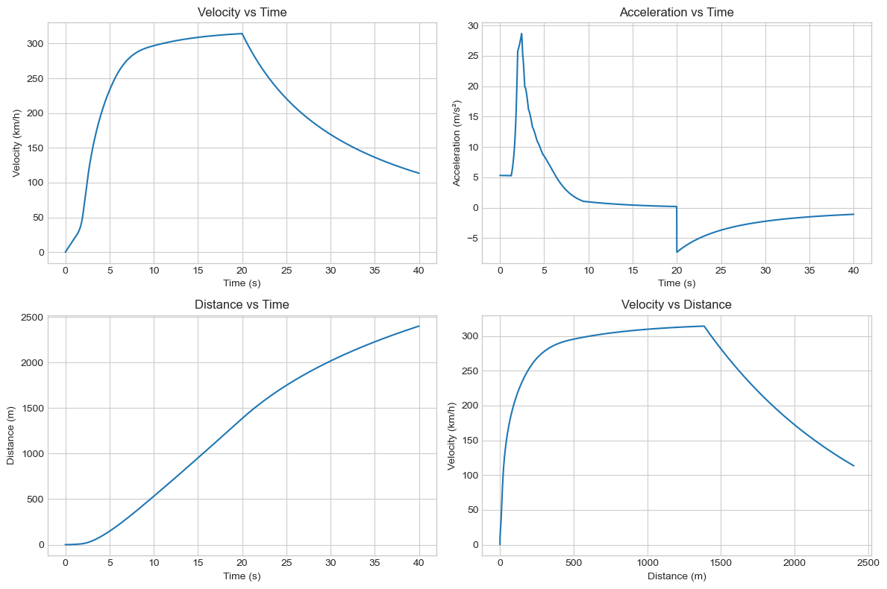
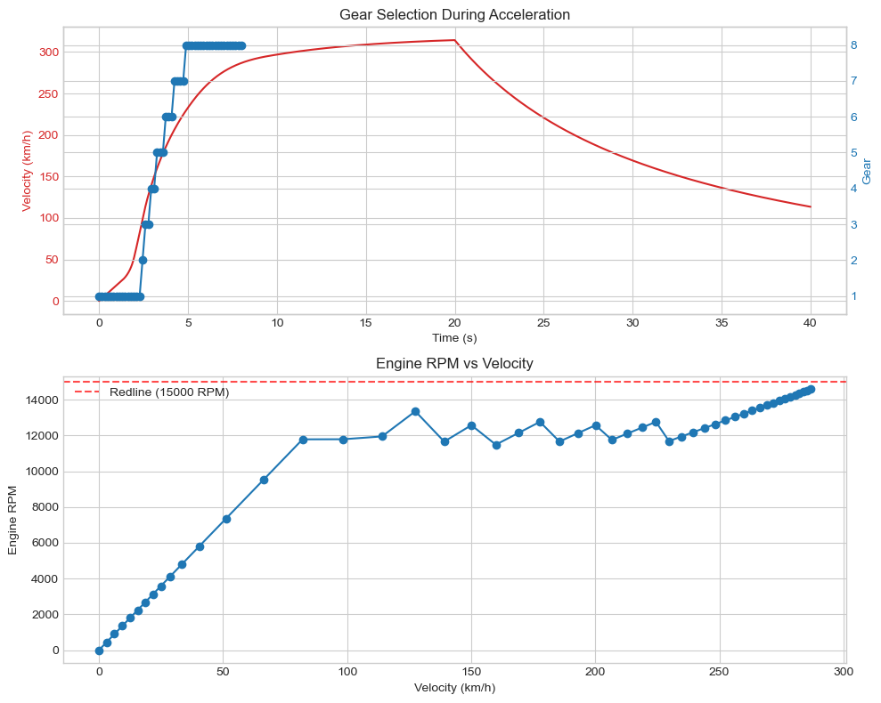
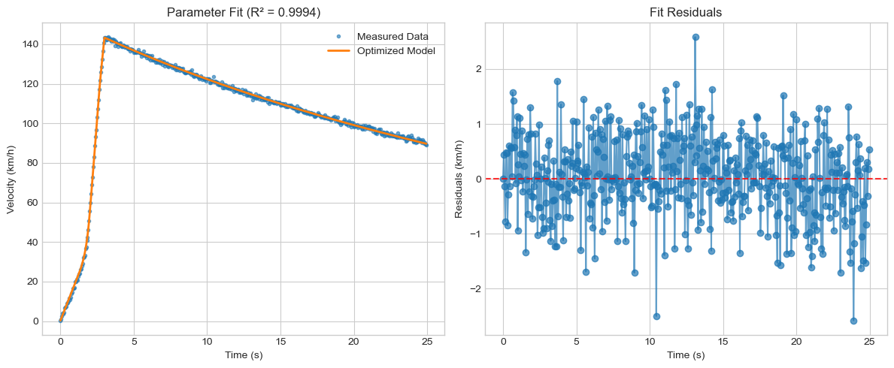
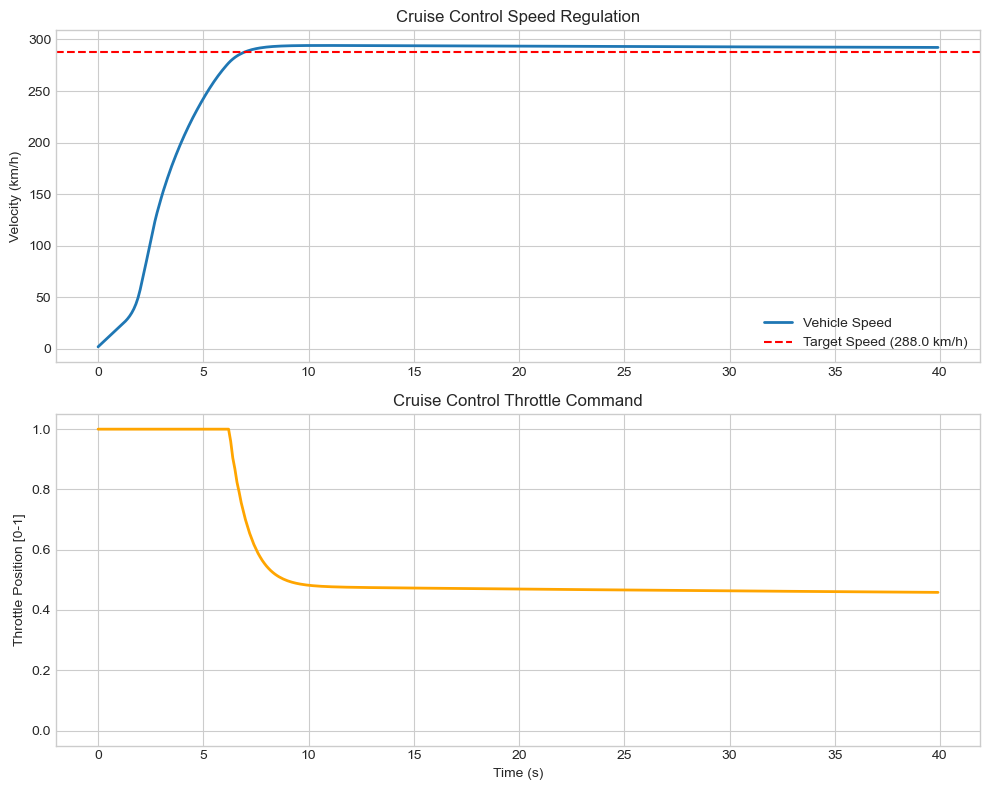
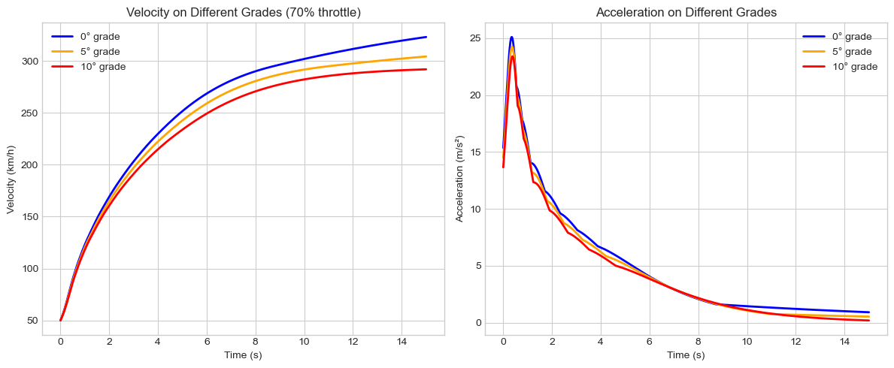

# Vehicle Dynamics & Control Simulation

A comprehensive physics-based longitudinal vehicle model with gear shifting, torque modeling, coastdown fitting, and cruise-control PID implementation.


This project implements a complete longitudinal vehicle dynamics simulator, including realistic powertrain modeling, tire forces, aerodynamic effects, ODE integration, coastdown-based parameter estimation, and PID cruise control. It was developed as an end-to-end engineering workflow to explore model-based simulation, system identification, and feedback control — directly aligned with motorsport and automotive R&D practices.

## Features Overview

### Vehicle Physics
- **Aerodynamic effects**: Drag & downforce modeling
- **Tire dynamics**: Load-sensitive friction and rolling resistance
- **Powertrain**: Multi-gear transmission with torque → wheel force conversion
- **Braking system**: Realistic braking forces implementation
- **Environmental factors**: Road gradient & wind effects
- **Engine limits**: Soft rev-limiter and RPM constraints
- **Performance metrics**: Realistic acceleration, coastdown, and top-speed behavior

### Simulation Pipeline
- **ODE-based dynamics**: Numerical integration of longitudinal vehicle motion
- **Performance testing**: 0–100 km/h acceleration tests
- **Gear shifting**: Realistic multi-gear shifting respecting RPM limits
- **Top-speed analysis**: Equilibrium top-speed simulation
- **Coastdown analysis**: Telemetry sampling during deceleration
- **Sensor realism**: Noise injection for realistic measurement behavior

### Parameter Estimation
- **Coastdown identification**: Using `scipy.least_squares` optimization
- **Aerodynamic estimation**: Drag area (CdA) parameter identification
- **Rolling resistance**: Cr coefficient estimation
- **Physics constraints**: Identifiability considerations and bounds
- **Robust handling**: Noise tolerance and failed simulation recovery

### Control System
- **Discrete PID**: Cruise controller implementation
- **Stability tuning**: Optimized for smoothness and minimal overshoot
- **Derivative handling**: Avoids throttle oscillations
- **Realistic output**: Throttle demand mapping in feedback mode

## Repository Structure

project/
├── src/
│ ├── models.py # Longitudinal ODE model + forces
│ ├── simulate.py # Integration + drive cycles
│ ├── fit.py # Coastdown parameter estimation
│ └── control.py # PID controller logic
├── images/
│   ├── acceleration_curve.png
│   ├── coastdown_fit.png
│   └── cruise_control.png
├── demo.ipynb # Full simulation + fitting walkthrough
├── README.md
└── requirements.txt


## Example Results

### Acceleration Curve

*Realistic 0–100 km/h behavior showing gear shifts and top-speed convergence*

### Gear Selection during Acceleration

*Showing gear selection and rpm during accelaration period*

### Coastdown: Telemetry vs. Model Fit

*Parameter identification for CdA & Cr in noisy conditions*

### PID Cruise Control

*Smooth approach to target speed with no oscillation*

### Gear Selection during Acceleration

*Showing the velocity of the vehicle on differnt road grades*

## Engineering Challenges & Solutions

### 1. Unrealistic Acceleration & Excessive Top Speed
**Problem**: Initial acceleration runs were physically incorrect (300–700+ km/h)

**Root Causes**:
- Gear selection ignored RPM redline
- Torque lookup RPM clipped but kinematic RPM wasn't
- Missing rev-limiter implementation

**Solutions**:
- Correct engine RPM calculation from wheel speed and gear ratio
- Skip gears exceeding redline or dropping below idle
- Separate RPM clipping for torque lookup vs physics
- Added soft rev-limiter

**Result**: Realistic shift behavior and correct top-speed limit.

### 2. Coastdown Fitting Issues
**Problems**:
- Optimization converged to parameter bounds
- CLA (downforce sensitivity) unidentifiable during coastdown
- Noise caused Cr/CdA parameter drift

**Solutions**:
- Removed CLA from coastdown estimation (correct physics)
- Improved initial guesses and parameter bounds
- Matched throttle schedule to coastdown scenario
- Graceful handling of failed optimization steps

**Result**: Stable and accurate identification of CdA and Cr.

### 3. PID Cruise Control Behavior
**Observed Issues**:
- Throttle output appeared constant
- High Kd created oscillations
- High Ki caused overshoot

**Solutions**:
- Verified PID acted on speed error
- Stabilized derivative action
- Tuned Kp/Ki/Kd for smooth approach
- Ensured throttle stays in [0, 1] through force mapping

**Result**: Smooth, realistic cruise control without oscillations.

## Physics Model Summary

The simulator solves the longitudinal dynamics equation:

$$
m\dot{v} = F_{\text{drive}} - F_{\text{drag}} - F_{\text{roll}} - F_{\text{brake}}
$$

Where:

**Engine torque → wheel force**:
$$
F_{\text{drive}} = \frac{T_{\text{engine}}(RPM) \cdot g_{\text{gear}} \cdot g_{\text{final}}}{R_w}
$$

**Aerodynamic drag**:
$$
F_{\text{drag}} = \frac{1}{2} \rho C_d A v^2
$$

**Rolling resistance**:
$$
F_{\text{roll}} = C_r m g
$$

The model also includes: downforce effects, grip limits, braking dynamics, road gradient, and wind influence.

## 📦 Installation

```bash
git clone <repo_url>
cd project
pip install -r requirements.txt
